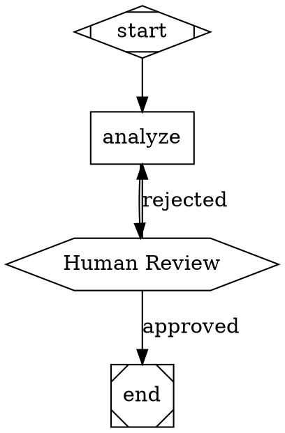
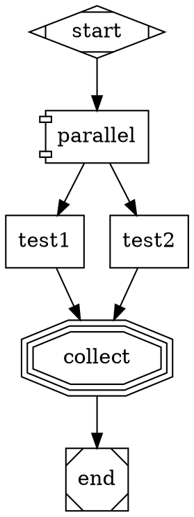
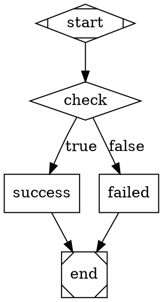
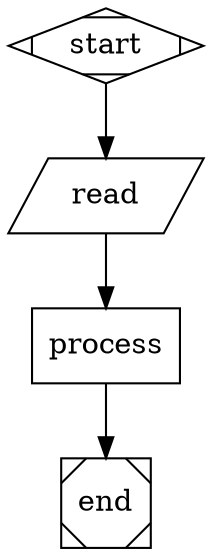

# Software Factory

A DOT-based pipeline runner for AI-driven software development, built on the [StrongDM Attractor](https://github.com/strongdm/attractor) specification.

## Overview

The Software Factory orchestrates multi-stage AI workflows using Graphviz DOT syntax. Each node in the graph is an AI task (LLM call, human review, conditional branch, parallel fan-out, etc.) and edges define the flow between them.

## Features

- **DOT-based pipelines** — Define workflows in Graphviz DOT syntax
- **Pluggable handlers** — Extensible node types
- **Human-in-the-loop** — Pause for approval at any node
- **Conditional routing** — Route based on conditions
- **Parallel execution** — Run multiple branches simultaneously
- **Tool execution** — Run shell commands, read files, etc.
- **Manager loop** — Spawn subagents for parallel work
- **Multiple LLM providers** — LM Studio, Ollama, OpenCode
- **CLI & Web UI** — Run and visualize pipelines
- **Artifact storage** — Save prompts and responses for debugging

## Installation

```bash
cd /home/dallum/projects/software-factory
composer install
```

## Quick Start

### CLI

```bash
# Run a pipeline
php artisan factory:run examples/simple.dot --model=qwen3-14b

# Run with auto-approval (skip human prompts)
php artisan factory:run examples/simple.dot --auto

# Run with specific approval decision
php artisan factory:run examples/simple.dot --approve=review --decision=approved

# Run without saving artifacts
php artisan factory:run examples/simple.dot --no-artifacts

# Visualize a pipeline
php artisan factory:visualize examples/simple.dot

# Lint (validate) a pipeline
php artisan factory:lint examples/simple.dot

# List saved artifacts
php artisan factory:artifacts
```

### Web UI

```bash
php artisan serve
# Open http://localhost:8000
```

The Web UI also supports model selection and human approval via the browser.

## CLI Options

| Option | Description |
|--------|-------------|
| `--model=` | Model to use (default: qwen3-14b) |
| `--provider=` | LLM provider: lmstudio, ollama (default: lmstudio) |
| `--approve=` | Auto-approve a specific node (e.g., --approve=review) |
| `--decision=` | Approval decision: approved or rejected (default: approved) |
| `--auto` | Auto-approve all approval nodes without prompting |
| `--artifacts=` | Directory to save prompts/responses |
| `--no-artifacts` | Disable artifact saving |
| `--context=` | JSON context to pass to pipeline |
| `--dot=` | Inline DOT graph (instead of file) |

## Pipeline Examples

### Simple Pipeline



### Parallel Execution



### Conditional Routing



### Tool Execution



## Node Handlers

| Shape | Handler | Description |
|-------|---------|-------------|
| `Mdiamond` | start | Pipeline entry point |
| `Msquare` | exit | Pipeline exit point |
| `box` | codegen | Execute LLM |
| `hexagon` | wait.human | Human approval gate |
| `diamond` | conditional | Conditional routing |
| `component` | parallel | Parallel fork |
| `tripleoctagon` | fan_in | Collect parallel results |
| `parallelogram` | tool | Execute tools |
| `house` | manager | Spawn subagents |

## Supported Tools

- `read_file` — Read file contents
- `list_dir` — List directory contents
- `search` — Search files for content
- `bash` — Execute shell command
- `write_file` — Write content to file
- `glob` — Find files by pattern

## Human Approval

### How It Works

When a pipeline reaches a hexagon (`hexagon`) node, it pauses and waits for human approval:

1. **Web UI**: Shows Approve/Reject buttons in the browser
2. **CLI**: Displays a message showing which node needs approval

### CLI Approval

```bash
# Approve a specific node
php artisan factory:run examples/simple.dot --approve=review --decision=approved

# Reject and route to rejection edge
php artisan factory:run examples/simple.dot --approve=review --decision=rejected

# Auto-approve ALL approval nodes
php artisan factory:run examples/simple.dot --auto
```

### DOT Syntax

```dot
review [shape=hexagon, label="Human Review"]
review -> next_step [label="approved"]   # Routes here if approved
review -> retry_step [label="rejected"]  # Routes here if rejected
```

## Artifact Storage

Each LLM call can save prompts and responses to disk for debugging and audit:

```bash
# Artifacts saved to storage/artifacts/ by default
php artisan factory:run examples/simple.dot

# Custom directory
php artisan factory:run examples/simple.dot --artifacts=/tmp/pipeline-artifacts

# Disable artifacts
php artisan factory:run examples/simple.dot --no-artifacts

# List saved artifacts
php artisan factory:artifacts
```

### Artifact Files

Artifacts are named: `{timestamp}_{counter}_{node_id}_{type}.txt`

- `*_prompt.txt` — Full prompt sent to LLM
- `*_response.txt` — LLM response

## Model Stylesheets

Model stylesheets define model-specific settings like temperature, max tokens, and prompt templates.

```bash
# List available stylesheets
php artisan factory:stylesheets

# Show stylesheet for specific model
php artisan factory:stylesheets --model=qwen3-14b
```

### Built-in Stylesheets

| Model | Temperature | Max Tokens | Use Case |
|-------|-------------|------------|----------|
| qwen3-14b | 0.3 | 4096 | Coding |
| deepseek-r1 | 0.6 | 8192 | Reasoning |
| ibm/granite-4-h-tiny | 0.5 | 4096 | Enterprise |

### Custom Stylesheets

You can register custom stylesheets programmatically:

```php
use App\Pipeline\Stylesheets\ModelStylesheet;

$stylesheet = new ModelStylesheet();
$stylesheet->register('my-model', [
    'temperature' => 0.5,
    'max_tokens' => 2048,
    'prompt_prefix' => "You are a helpful assistant.\n\n",
    'prompt_suffix' => "\n\nBe concise.",
]);
```

## Configuration

### LLM Providers

```php
use App\LLM\LMStudioClient;
use App\LLM\OllamaClient;
use App\LLM\ProviderManager;

$manager = new ProviderManager();
$manager->register('lmstudio', new LMStudioClient('http://localhost:1234/api/v0'), 100);
$manager->register('ollama', new OllamaClient('http://localhost:11434'), 90);
```

### Running with Different Models

```bash
# LM Studio
php artisan factory:run examples/simple.dot --model=qwen3-14b

# Ollama
php artisan factory:run examples/simple.dot --provider=ollama --model=llama3
```

## API

### Programmatic Usage

```php
use App\Pipeline\DOTParser;
use App\Pipeline\Engine;
use App\LLM\LMStudioClient;

$dot = file_get_contents('examples/simple.dot');
$parser = new DOTParser();
$graph = $parser->parse($dot);

$engine = new Engine();
$engine->setLLM(new LMStudioClient('http://localhost:1234/api/v0', 'qwen3-14b'));

$result = $engine->execute($graph, 'start');

// Check for approval
if ($result['status'] === 'waiting_for_approval') {
    $waitingNode = $result['waiting_node'];
    
    // Provide approval
    $engine->provideApproval($waitingNode, true);
    
    // Resume
    $result = $engine->execute($graph, $waitingNode, $result['context']);
}
```

## Testing

```bash
php artisan test
```

## Documentation

- [ARCHITECTURE.md](./documentation/ARCHITECTURE.md) — Detailed architecture
- [CONFORMANCE.md](./documentation/CONFORMANCE.md) — Spec conformance analysis

## References

- [StrongDM Attractor](https://github.com/strongdm/attractor) — Original specification
- [Graphviz DOT](https://graphviz.org/doc/info/lang.html) — DOT language reference

## License

MIT
