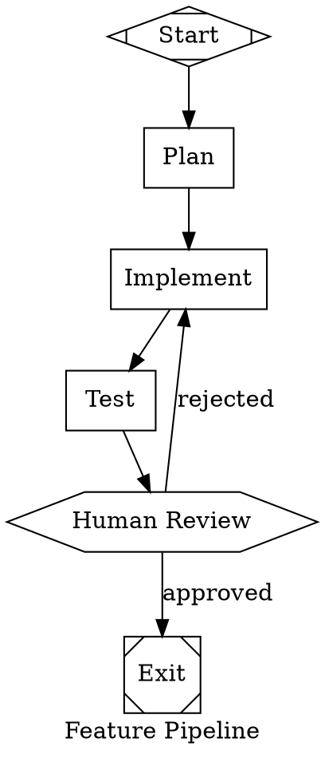

# Software Factory Architecture

**Project:** Attractor-Based Software Factory  
**Based on:** StrongDM Attractor Specification  
**Created:** 2026-02-20  
**Updated:** 2026-02-21  
**Status:** Phase 3 Complete

---

## 1. Overview

This project implements a DOT-graph-based agent orchestration system inspired by StrongDM's Attractor. The goal is to build a deterministic, visual, version-controllable pipeline for AI-driven software development.

---

## 2. Architecture

```
┌─────────────────────────────────────────────────────────┐
│                    Host Application                      │
│              (CLI, Web UI, or IDE Plugin)             │
└─────────────────────────┬───────────────────────────────┘
                          │ events / submit()
                          ▼
┌─────────────────────────────────────────────────────────┐
│                   Pipeline Engine                       │
│  ┌─────────────┐  ┌─────────────┐  ┌─────────────┐  │
│  │ DOT Parser  │──│ Graph       │──│ Engine     │  │
│  │   ✓ DONE   │  │   ✓ DONE   │  │   ✓ DONE  │  │
│  └─────────────┘  └─────────────┘  └─────────────┘  │
└─────────────────────────┬───────────────────────────────┘
                          │
                          ▼
┌─────────────────────────────────────────────────────────┐
│                    Node Handlers                        │
│  ┌──────────┐ ┌──────────┐ ┌──────────┐ ┌─────────┐│
│  │codergen  │ │ wait.    │ │condit-   │ │parallel ││
│  │  ✓ DONE  │ │ human    │ │ional     │ │         ││
│  │          │ │ ✓ DONE   │ │ ✓ DONE   │ │✓ DONE  ││
│  └──────────┘ └──────────┘ └──────────┘ └─────────┘│
└─────────────────────────────────────────────────────────┘
                          │
                          ▼
┌─────────────────────────────────────────────────────────┐
│                    Agent Loop                           │
│  ┌──────────┐ ┌──────────┐ ┌──────────┐ ┌─────────┐ │
│  │ Session  │ │ Ollama   │ │ Tools    │ │Exec Env │ │
│  │   ✓ DONE │ │  Client  │ │   ✓ DONE │ │ PENDING │ │
│  │          │ │   ✓ DONE │ │          │ │         │ │
│  └──────────┘ └──────────┘ └──────────┘ └─────────┘ │
└─────────────────────────┬───────────────────────────────┘
                          │
                          ▼
┌─────────────────────────────────────────────────────────┐
│               Unified LLM Client                       │
│     (Ollama ✓, LM Studio ✓, ProviderManager ✓)       │
└─────────────────────────────────────────────────────────┘
                          │
                          ▼
┌─────────────────────────────────────────────────────────┐
│                  Provider Manager                       │
│  ┌──────────┐ ┌──────────┐ ┌──────────┐ ┌─────────┐ │
│  │ LM Studio│ │ Ollama   │ │OpenCode  │ │ OpenAI  │ │
│  │ (local)  │ │ (local)  │ │  (CLI)   │ │(hosted) │ │
│  └──────────┘ └──────────┘ └──────────┘ └─────────┘ │
└─────────────────────────────────────────────────────────┘
```

---

## 3. Implementation Status

### Phase 1: DOT Parser & Graph ✅ COMPLETE

| Component | Status | Description |
|-----------|--------|-------------|
| `DOTParser` | ✅ Done | Parses Graphviz DOT syntax |
| `Graph` | ✅ Done | Graph data structure |
| `Node` | ✅ Done | Node representation |
| `Edge` | ✅ Done | Edge representation |

### Phase 2: Pipeline Engine ✅ COMPLETE

| Component | Status | Description |
|-----------|--------|-------------|
| `Engine` | ✅ Done | Graph traversal and execution |
| Default handlers | ✅ Done | Start, exit, box, hexagon, diamond |
| Context passing | ✅ Done | State flows between nodes |
| Custom handlers | ✅ Done | Register own handlers by shape |

### Phase 3: Agent Loop & LLM ✅ COMPLETE

| Component | Status | Description |
|-----------|--------|-------------|
| `ClientInterface` | ✅ Done | LLM client abstraction |
| `OllamaClient` | ✅ Done | Local Ollama integration |
| `Session` | ✅ Done | Agent session with history |
| Tool parsing | ✅ Done | Parse tool calls from responses |
| Built-in tools | ✅ Done | read_file, list_dir, search |

**Tests:** 29 passing

### Phase 3: Advanced Features
- [x] Human-in-the-loop ✅
- [x] Checkpoint/resume ✅
- [x] Conditional routing ✅
- [x] Parallel execution ✅

### Phase 3 Advanced Features Detail

#### Human-in-the-Loop (Hexagon)
The hexagon node pauses pipeline execution for human approval:

```dot
review [shape=hexagon, label="Human Review"]
approved [shape=box, label="Approved"]
rejected [shape=box, label="Rejected"]

review -> approved [label="approved"]
review -> rejected [label="rejected"]
```

**Usage:**
```php
$engine = new Engine();
$result = $engine->execute($graph, 'start', $context);

// Check if waiting for approval
if ($engine->isWaitingForApproval()) {
    $waitingNode = $engine->getWaitingNodeId();
    // Show to user, wait for input...
}

// Provide human decision
$engine->provideApproval('review', true); // true = approved, false = rejected

// Resume execution
$result = $engine->execute($graph, $waitingNode, $result['context']);
```

#### Conditional Routing (Diamond)
The diamond node evaluates conditions to route execution:

```dot
decision [shape=diamond, condition="errors > 0"]
success [shape=box, label="Success"]
failed [shape=box, label="Failed"]

decision -> success [label="true"]
decision -> failed [label="false"]
```

**Supported Conditions:**
- Variable check: `tests_pass` → true if context['tests_pass'] is truthy
- Negation: `!variable` → true if variable is falsy/not set
- Comparisons: `errors > 0`, `count == 5`, `score >= 80`
- Boolean: `cond1 AND cond2`, `cond1 OR cond2`

#### Checkpoint / Resume
The Engine maintains context between executions, enabling:
1. Pause at any node (especially hexagon for human input)
2. Provide additional context/approval
3. Resume from where it left off

#### Parallel Execution (Component + Tripleoctagon)
The component node forks execution to multiple parallel branches, tripleoctagon collects results:

```dot
start [shape=Mdiamond]
parallel [shape=component, label="Run Tests"]
test_unit [shape=box, label="Unit Tests"]
test_integration [shape=box, label="Integration Tests"]
test_e2e [shape=box, label="E2E Tests"]
collect [shape=tripleoctagon, label="Collect Results"]
end [shape=Msquare]

start -> parallel
parallel -> test_unit
parallel -> test_integration
parallel -> test_e2e
test_unit -> collect
test_integration -> collect
test_e2e -> collect
collect -> end
```

**How it works:**
- `component` node identifies all outgoing edges as branches
- Each branch executes sequentially (PHP is synchronous)
- Results are collected in `parallel_results_{nodeId}` context
- `tripleoctagon` (fan-in) marks completion and merges context

#### Code Generation (Box)
The box node executes an LLM to generate code or perform tasks:

```dot
start [shape=Mdiamond]
plan [shape=box, prompt="Create a plan for the feature"]
implement [shape=box, prompt="Implement the feature based on this plan"]
review [shape=hexagon, label="Human Review"]
end [shape=Msquare]

start -> plan
plan -> implement
implement -> review
review -> end
```

**Usage:**
```php
use App\Pipeline\DOTParser;
use App\Pipeline\Engine;
use App\LLM\LMStudioClient;

$parser = new DOTParser();
$graph = $parser->parse($dot);

$engine = new Engine();
$engine->setLLM(new LMStudioClient('http://localhost:1234'));

$result = $engine->execute($graph, 'start');

// Access generated code
echo $result['context']['llm_response'];
```

**Node attributes:**
- `prompt` - The instruction to send to the LLM
- If not provided, uses the node label

**Context results:**
- `llm_response` - The LLM's response
- `llm_status` - completion status

---

### Phase 4: Integration

- [x] Multiple LLM providers ✅
- [x] Web UI / CLI ✅
- [x] Lint rules ✅
- [ ] Docker execution environment

#### CLI Commands
The software factory includes Artisan commands for running pipelines:

```bash
# Run a pipeline from a DOT file
php artisan factory:run examples/simple.dot

# Run with inline DOT
php artisan factory:run --dot="digraph { start [shape=Mdiamond] end [shape=Msquare] start -> end }"

# Run with specific provider
php artisan factory:run examples/simple.dot --provider=ollama

# Pass context
php artisan factory:run examples/simple.dot --context='{"file":"app/Http/Controller.php"}'

# Visualize a pipeline
php artisan factory:visualize examples/simple.dot
php artisan factory:visualize examples/simple.dot --format=json

# Lint a pipeline (validate before running)
php artisan factory:lint examples/simple.dot
```

#### Provider Manager
The `ProviderManager` handles multiple LLM providers with automatic fallback:

```php
use App\LLM\ProviderManager;
use App\LLM\LMStudioClient;
use App\LLM\OllamaClient;
use App\LLM\OpenCodeClient;

$manager = new ProviderManager();

// Register providers with priorities (higher = preferred)
$manager->register('lmstudio', new LMStudioClient('http://localhost:1234'), 100);
$manager->register('ollama', new OllamaClient('http://localhost:11434'), 90);
$manager->register('opencode', new OpenCodeClient('claude-opus-4-5'), 80);

// Or use standard local-first setup
$manager->registerStandardProviders();

// Get best available (highest priority enabled)
$client = $manager->getBest();

// Auto-failover: test each provider until one works
$client = $manager->getWorking();

// Check status of all providers
$status = $manager->status();
// ['lmstudio' => ['enabled' => true, 'priority' => 100, 'available' => true], ...]
```

**Supported Providers:**
| Provider | Type | Priority Default |
|----------|------|------------------|
| LM Studio | Local HTTP | 100 |
| Ollama | Local HTTP | 90 |
| OpenCode | Local CLI | 80 |
| OpenAI | Hosted API | 50 |
| Anthropic | Hosted API | 50 |

---

#### Tool Handler (Parallelogram)
The parallelogram node executes specific tools:

```dot
start [shape=Mdiamond]
read_config [shape=parallelogram, tool="read_file", path="config.json"]
process [shape=box, prompt="Process this: {{tool_result_read_config}}"]
end [shape=Msquare]

start -> read_config
read_config -> process
process -> end
```

**Supported Tools:**
| Tool | Description | Example |
|------|-------------|---------|
| read_file | Read file contents | `tool="read_file", path="app.php"` |
| list_dir | List directory contents | `tool="list_dir", path="."` |
| search | Search files for content | `tool="search", query="function", path="."` |
| bash | Execute shell command | `tool="bash", cmd="ls -la"` |
| write_file | Write content to file | `tool="write_file", path="out.txt", content="hello"` |
| glob | Find files by pattern | `tool="glob", pattern="*.php", path="app"` |

**Context Variables:**
Use `{{variable}}` syntax to reference context:
```dot
node [shape=parallelogram, tool="read_file", path="{{config_file}}"]
```

**Results:**
- `tool_result` - The tool's output
- `last_tool` - The tool that was executed
- `tool_result_{nodeId}` - Namespaced result

---

#### Manager Loop Handler (House)
The house node spawns subagents for parallel work:

```dot
start [shape=Mdiamond]
analyze [shape=house, agent="coder", task_1="Analyze the codebase", task_2="Find security issues", task_3="Check performance"]
merge [shape=box, prompt="Merge findings: {{manager_results_analyze}}"]
end [shape=Msquare]

start -> analyze
analyze -> merge
merge -> end
```

**Configuration:**
| Attribute | Description | Default |
|-----------|-------------|---------|
| agent | Agent type to spawn | default |
| max | Max parallel agents | 5 |
| task_X | Task X prompt | - |

**Context:**
- `manager_task_count` - Number of tasks executed
- `manager_results` - Array of results
- `manager_results_{nodeId}` - Namespaced results

---

## 4. Directory Structure

```
/home/dallum/projects/software-factory/
├── app/
│   └── Pipeline/
│       ├── DOTParser.php      # ✅ Parses Graphviz DOT syntax
│       ├── Graph.php         # ✅ Graph data structure
│       ├── Node.php          # ✅ Node representation
│       ├── Edge.php          # ✅ Edge representation
│       └── Engine.php        # ✅ Graph traversal & execution
│   ├── Agents/
│   │   └── Session.php      # ✅ Agent session with history
│   └── LLM/
│       ├── ClientInterface.php # ✅ LLM client interface
│       └── OllamaClient.php    # ✅ Local Ollama integration
├── documentation/
│   └── ARCHITECTURE.md       # This file
├── tests/
│   ├── Unit/Pipeline/
│   │   ├── DOTParserTest.php # ✅ 4 passing tests
│   │   └── EngineTest.php   # ✅ 5 passing tests
│   └── Unit/Agents/
│       └── SessionTest.php   # ✅ 6 passing tests
├── vendor/
├── composer.json
└── artisan
```

---

## 5. DOT Graph Structure

### 5.1 Example Pipeline



### 5.2 Node Types

| Shape | Handler | Status |
|-------|---------|--------|
| box | codergen | ✅ Done |
| hexagon | wait.human | ✅ Done |
| diamond | conditional | ✅ Done |
| component | parallel | ✅ Done |
| tripleoctagon | parallel.fan_in | ✅ Done |
| parallelogram | tool | ✅ Done |
| house | stack.manager_loop | ✅ Done |
| Mdiamond | start | ✅ (start node) |
| Msquare | exit | ✅ (exit node) |

---

## 6. Reference

- StrongDM Attractor: https://github.com/strongdm/attractor
- Attractor Specification
- Coding Agent Loop Specification
- Unified LLM Client Specification

---

*This document is updated after each phase completion.*

---

## See Also

- [CONFORMANCE.md](./CONFORMANCE.md) - Spec conformance analysis
